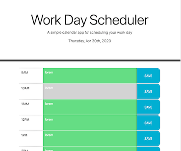

# Work Day Scheduler Homework

## Task

In this exercise, we were tasked with creating a simple calendar application that allows the user to save events for each hour of the day. It features dynamically updated HTML and CSS powered by jQuery.

## Process

As I'm more comfortable with vanilla Javascript vs. jQuery, I first coded everything out in vanilla JS to make sure the app worked. Then I converted everything to jQuery once it was working in vanilla JS. 

Here is how the app appears in-browser:

## Status

This assigment is complete other than one remaining issue: Currently the 'save' function only works in the first time slot. I still have to get it to work in the other time slots.